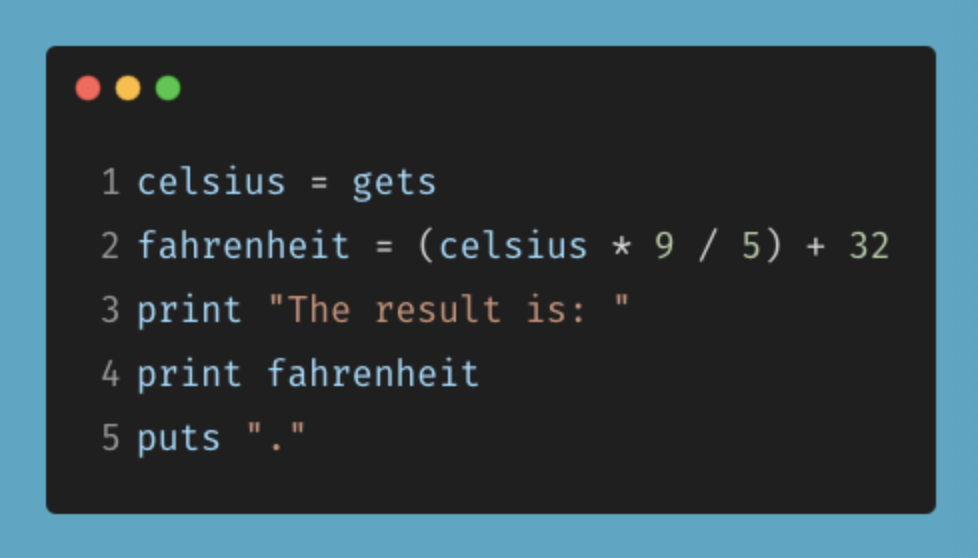
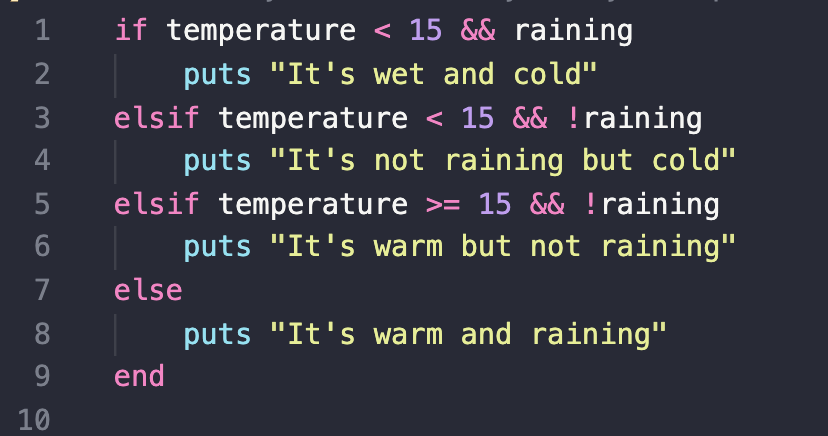

# T1A1 - Workbook - Julia Ohannessian

### Identify and explain common and important components and concepts of web development markup languages

Web development mark up languages are a set of guidelines or rules that add information to electronic documents. They are a link between humans and computers. It's there to help make structure and content easier to understand. Below is a list of markup languages:

**_Older markup languages:_**

- troff
- TeX
- LaTeX

**_Markup languages:_**

- HTML
- Scribe
- XML
- SGML
- Markdown

Most markup languages use a set of instructions. These instructions breakdown a document to explain what each part is. It's also used to show how a document should be formatted. Some of the components and concepts used in HTML, which is one of the more common markup languages, are as follows:

A tag: This is where an element in a HTML doc starts and finishes. They are used in pairs which begin and end with a < > these are referred to as greater-than and less-than symbols. Inside these symbols is an instruction that indicates what goes inside that particular tag. When the tag is closed a backslash is included like so </>

If we are looking at an example of this inside a HTML DOC a title tag would look like this:

`<title> </title>`

An element is an extension a tag and is what goes inbetween the two tags. It is where the title would go:

`<title>This Is My Title</title>`

A p tag, which is a paragaph tag would look like so:

`<p> </p>`

The element inbetween the opening and closing p tags would look like this:

`<p>Nulla malesuada, neque non porta viverra, arcu dui sagittis dui, vel rutrum nisi augue non dui. Orci varius natoque penatibus et magnis dis parturient montes, nascetur ridiculus mus. Nunc sagittis mauris a elit vehicula, eget venenatis mi consectetur. Nam pretium pellentesque porttitor. Etiam porta sapien neque, eget commodo augue tempor condimentum. Fusce pharetra non ex nec elementum. Nam cursus leo libero, vel laoreet neque fringilla sit amet. Integer blandit justo non sodales facilisis. Vestibulum dapibus urna id tellus egestas, nec cursus urna tempus. Sed lacinia nisl vel felis auctor, ac rhoncus dolor ultricies.</p>`

_reference resource: https://lipsum.com/feed/html_

There are a lot more to look at but here is an image taken from https://www.semrush.com/blog/markup-language/ it shows a couple more tags and what they mean.


### Define the features of the following technologies that are essential in terms of the development of the internet:

**Packets**

A packet is a smaller message taken from a larger one. It's data that gets split into tiny packets (bytes) so that it can be sent through the network and reassembled at it's destination. This makes routing more efficient.
Each packet is individually numbered and it contains the internet address of the destination. This means that over time the size of a message that is sent through can be larger than in the earlier days thaqnks to packets.

Packets are made up of a header, payload and trailer.

- The 'header' consists of instructions which are related to the data that is found inside the packet.

- The 'payload' is the data that is contained inside the packet.

- The 'trailer' also known as a 'footer' notifies the receiving device that it has reached the end.


_reference image resource: https://techtarget.com/searchnetworking/definition/packet_

**IP addresses (IPv4 and IPv6)**

An IP address (Internet Protocol Address) is a sequence of numbers that is given to a device (mobile or computer) when it connects to the internet or a network. It works like a personal email address but for computers and devices. It is a virtual link between a destination and a source machine. The computer, router and server each have their own specific IP address which allows them to recognise each other. This is how they communicate with one another. They also retrieve data and send data through these unquie IP addresses.

**IPv4 and IPv6**

The most widely used is Internet Protocol version 4 (IPv4). It consists of 12 header fields and is in the form of a 4-tuple of octets and dot notation. An example of dot notation is as follows:

**243.38.717.334**

The The IPv4 addresses consist of two parts, first part the network prefix (it determines the network to which the address belongs), the second part, the host identifier, which helps to identify the host within that network.

Whereas IPv6 is written in eight sets of 16-bit hexadecimal digits separated by colons. Here is an example:

**2011:4GFS:8D28:FE75:A95A:1C28:50DF:6AB6**

Due to the fast rate at which the internet is expanding IPv6 was created to replace IPv4 because the number of variations for IPv4 has almost run out.

With IPv6 the routing is a lot better because it allows internet service providers to reduce the size of routing tables. IPv6 also uses a IPsec which stands for 'Internet Protocol Security'. This means that there is no need to be concerned about security and cofidentiality.

The IPv6 doesn't have an IP checksum, resulting in more efficient packet processing, and it supports multicast. As a result, data flows can be sent to multiple destinations simultaneously, saving network bandwidth.

### **Routers and routing**

A router is a piece of organization equipment liable for sending bundles to their destinations. Routers interface with at least two IP organizations or subnetworks and pass information parcels between them on a case by case basis. Routers are utilized in homes and workplaces for setting up neighborhood network associations. All the more impressive routers work all around the Internet, assisting information parcels with arriving at their destinations.

Routers course IP Packets across networks. A router device associates various connections. It filters a header of an IP packet, it searches for the destination location and counsels a routing table of known networks. The table recognizes which connections to send the packet, as per the IP address, on as the following connection.

The links on a router are called interfaces: through the router, they interface between various connection types.

Network routing is the method involved with choosing a way across at least one network. The standards of routing can apply to a network, from phone networks to public transportation. In packet-switching networks, like the Internet, routing chooses the ways for Internet Protocol (IP) packets to venture out from their starting point to their destination. These Internet routing choices are made by specific bits of network hardware called routers.

Below is an image that demonstrates a data packet travelling from Computer A to Computer B. If the data packet travels through networks 1, 3, and 5 it might travel a lot faster than if it traveled through networks 2 and 4. Even though the journey through networks 2 and 4 is shorter. These are the kinds of choices network routers constantly make.


### **Domains and DNS**

A domain helps to identify a website. There are so many websites avaliable in the www. It is very important to have a domain/domain name because this allows the website to be visible to the user.

When a website or webpage is visited by a user, the location of the page is located on the top of the page this is called a URL which stands for a Uniform Resource Locator. An example of this would be as follows:

https://www.markdownguide.org/cheat-sheet/

The domain would be "markdownguide.org". This points to the home page of the website.

A user can purchase and register domain names. This can be done from the name registrar. Once a user purchases a domain for a website it is a unique URL for the time of the registration. Once the registration is up the URL is free to be purchased by anyone.

DNS stands for Domain Name System. It's there to convert the domain name to the corresponding IP address. When the user enters the domain in the browser, the DNS changes that over to the relating IP address to find and show the necessary site.

### Explain how each technology has contributed to the development of the internet.

### Define the features of the following technologies that are essential in terms of the development of the internet:

#### - TCP

#### - HTTP and HTTPS

#### - Web browsers (requests, rendering and developer tools)

### Explain how each technology has contributed to the development of client and server communication over the internet (50 - 150 words for each technology)

**TCP**

TCP, otherwise known as Transmission Control Protocol, is a network layer protocol which defines the rules and standards for how information is exchanged over a network. Together with IP (Internet Protocol), they establish and maintain the connection between sender and receiver and guarantee a packet order. Essentially, these two protocols form the basic structure that defines the internet as we know it today. TCP breaks down data into packets that can sent over a network, sends and receives packets through the network layer, takes care of dropped or broken packets, and makes sure that all packets have arrived at their destination. Unlike UDP (User Datagram Protocol) which is a connectionless protocol that doesn’t care if all packets have arrived at their destination, TCP’s formal established connection guarantees data integrity.

**HTTP and HTTPS**

HTTP, or Hypertext Transfer Protocol, is an application layer protocol that determines how information is exchanged between two devices on a network, typically a client and a server. It is a stateless protocol, which means that nothing is saved, and is used to load web pages on the internet with Hypertext links. Generally, a url beginning with `http://` would be typed into the client (browser) but the user, the client would then send a request to the web server that hosts the site, the server would typically return a response in the form of an HTML page, and then the browser would then display the response to the user. HTTPS is the secure version of HTTP. HTTPS is encrypted using TLS (Transport Layer Security) in order to bolster the security of data that is transferred

**Web Browsers**

Web Browsers are integral to the way that we interact with the Internet today. They are essentially the portal to all the information that can be accessed on the World Wide Web. Visiting a website on the internet can be done by simply typing the URL (Uniform Resource Locator) in the browser. This sends a request to a server that responds with HTML which is then rendered in our browser. Most browsers have an internal cache or local storage that can store particular user settings or sessions in order to optimise loading times and user experiences. Most modern browsers come with a suite of developer tools which allow us to inspect the HTML, CSS and JavaScript as well as provide a JavaScript console playground to run code. Network requests can also be tracked in these dev tools.

### Identify THREE data structures used in the Ruby programming language and explain the reasons for using each.

**Arrays**

Arrays are like containers. They are used to store data of multiple array elements either of the same or of different types. The structure of an array would be as follows:

`dessert = ["Cookies", "Cake", "Muffins"]`

First a name is assigned, this can be anything, then create an array using square brackets. Inside the array there is a list of three elements which are all strings. The great thing about arrays is that you can store as many elements as you wish.

As I mentioned above an array can store different types of elements. For example, the following array contains a string, boolean, and an integer.

`numbers = ["One", false, 4]`

Arrays are always indexed. The first element is indexed at position zero. To access elements inside the array you would do as follows remembering the index always starts at 0. If I wanted to access the integer from the above array I would 'puts' this to the screen:

`numbers[2]` or alternatively I could also 'puts' `numbers[-1]` both are valid.

There are many reasons why you would use an array. Let's say that if you had a bunch of information and didn't use an array to store it you would have to use multiple variables. So, if you had a thousand elements, that would be a thousand variables as opposed to just using one. Arrays are amazing because you can create an 'empty' array and add elements to it later on, you change an element, delete an element, add an element etc.

**Hash**

A Hash is an assortment of key-value pairs written this way:`{"worker" => "pay"}`. Ordering is done through arbitrary keys of any object type, not an integer index.

Hashes are used to store different properties. It allows the user to store much more complex data.

**Set (or stack)**

A set is a class that stores items like an array. All items in the set are guaranteed to be unique.

This is great to use when you have a list of items with no duplicates.

### Describe the features of interpreters and compilers and how they are different.

Interpreters and Compilers are both tools that we use in order to convert our high-level, human-friendly software development language into machine code that a computer understands. Both Interpreters and Compilers have their pros and cons. A compiler goes through the whole source code and converts it all into machine code while an interpreter only converts the source code one line at a time. The analysis of this code is slower for compilers than interpreters but conversely, the execution of the code is generally faster for compilers. There is no output file to interpreters but there are to compilers. Compiled languages must be compiled before executed, interpreted languages can just be run which makes them great for beginners and people wanting to code quickly.

### Identify TWO commonly used programming languages and explain the benefits and drawbacks of each.

Javascript is one of the most versatile and popular programming languages enabling developers to build web apps, servers, mobile apps, AI and games. It runs on all browsers making it a very ubiquitous programming language. Due to web browser optimisations, Javascript is and can her very fast. Some of the drawbacks of JavaScript are that it is dynamically typed which may be a problem for debugging larger scale applications (this has been addressed by TypeScript). It also can be the source for security concerns as JavaScript is executed on the client-side and bugs can sometimes be exploited for nefarious purposes.

C is one of the oldest programming languages that serves as the building block for many of today’s modern languages like Java, Python and C++. It is an incredibly powerful and fast language that allows you to assign memory allocation. It is compiled, which means that the source code is translated and outputted to an executable which you can run rather than being interpreted. Unfortunately, there is no concept of Object Oriented Programming in C. It also doesn’t have run-time checking meaning that you have to recompile to see if any new errors/bugs have been introduced to your code

### Identify TWO ethical issues from the areas below and discuss the extent to which an IT professional is ethically responsible in terms of the issue.

#### Access to a user’s personal information

It is incumbent on all developers dealing with PII (personal identifiable information) to make responsible decisions in order to ensure that a user’s personal information is safeguarded and mitigate the risk that the user’s personal information is not uncovered by bad actors. There is a fantastic resource at https://www.oaic.gov.au/privacy/guidance-and-advice/what-is-personal-information which details exactly what personal information is and the types of personal information that exist. This also references an article that outlines a series of guidelines that organisations could follow to ensure they do not break the law. https://www.oaic.gov.au/privacy/australian-privacy-principles-guidelines.

Every organisation that deals with a user’s personal information should have policies in place to make sure that this information cannot be leaked in any way. They should also have guidelines of what to do in the unfortunate situation that this information has been compromised.

#### Intellectual property, copyright and acknowledgement

The copyright of intellectual property in the Tech industry is a very complicated thing to enforce. When dealing with copyright limitations, the ideas are not protected. This means that essentially, many different companies could potentially compete with the same idea or take liberties by copying a competitor’s idea. Copying the functionality or basic idea is not an infringement, as detailed in here resource https://www.ipaustralia.gov.au/ip-for-digital-business/develop/copyright. The “borrowing” of ideas is one that has existed in the Tech industry since it’s earl days, most notably in the Apple vs Microsoft case https://en.wikipedia.org/wiki/Apple_Computer,_Inc._v._Microsoft_Corp as well as the tensions between Oracle and the Hudson community which gave birth to Jenkins https://en.wikipedia.org/wiki/Jenkins_(software)

All in all, one could potentially file for a patent for a particular piece of software but it is very obvious that a precedent exists whereby the “borrowing” of ideas is the norm in Tech. This is also solidified by the inability to enforce the copyright of ideas and functionality of software.

### Conduct research into a case study of ONE of the ethical issues you have chosen discuss how an ethical IT professional should respond to the case study and how they might mitigate or prevent ethical breaches.

#### Access to a user’s personal information

In 2018, one of the largest personal information breaches by numerous cybercriminals against Marriott International, owner of one of the world’s largest hotel chains, was undertaken by cybercriminals through security vulnerabilities found in the company’s Starwood properties. Starwood was a company acquired by Marriott International in 2016 and through this merger and acquisition, many of Starwood’s exisiting security vulnerabilities were left as they were and not fixed or improved upon. The personal information of hundreds of millions of customers was compromised prompting severe recovery expenses, legal consequences and damages to Marriott International's reputation.

Put simply, the people at the coalface of these issues i.e. the developers, qas, would have a clear understanding of what the vulnerabilities might be and what must be done in order to fix them. Generally though, cybersecurity and its implementations are not prioritised in organisations until an incident actually occurs. Unfortunately, by the time there is an incident it is in fact too late. Effective security practices, like the updating of packages and libraries, source code analysis tools, network monitoring systems and endpoint detection products should have been considered to iron out vulnerabilities and mitigate risk of personal data being compromised.

The situation with Starwood was made worse by the fact that in 2014, two years before Marriott International acquired Starwood, Starwood’s guest reservation system was compromised without the company being made aware. This was exacerbated by the fact that when the merger and acquisition was finalised, Marriott International did not run a cybersecurity audit on Starwood and their products. They also allowed Starwood to continue operating as they were even though their system’s had been compromised on multiple occasions.

There were significant impacts to Marriott International because of this serious security event. Marriott incurred $30 million in expenses related to the recovery due to the breach, which included costs for the investigation process as well as paying for their customers to have access to security software. There weren’t also repetitional and financial ramifications. Marriott’s stock dropped immediately after the news of the breach was disclosed and it is estimated that they lost up to $1 billion of revenue due to loss of trust by their customers. They were also fined $120 million by the United Kingdom’s Information Commissioner’s Office for violating British Customer’s rights. Suffice to say, the consequences and ramifications of this debacle were far reaching and profound.

Having access to PII (Personal Identifiable Information) is a privilege and should be treated with the appropriate care and respect. All companies should be doing their very best to ensure that no PII (Personal Identifiable Information) should be compromised by bad actors. The 2018 Marriott International incident shows that no company, irrespective of their size or scale is immune from data breaches.

### Explain control flow, using examples from the Ruby programming language

Control flow is the construct whereby pieces of code are executed or not executed based on certain conditionals. Conditionals are statements that can be either true or false and we can use them in order to control what code we want executed.

We normally use if, else, elsif blocks in ruby but we can also use case statements.


_reference image resource: https://medium.com/@soni.dumitru/control-flow-in-ruby-18bdd6bdb92d_

A breakdown of the above code:

User inputs an answer and it gets stored in the variable "answer". It then goes through the 'if' statement to see what the answer is equal to. If the answer is equal to "age", "gender", "country", "income", or "grammy" then the puts directly underneath that one gets out putted to the screen. With `.strip` it removes the whitespace characters. Conditials have been set up and we can control the flow.

### Explain type coercion

Type coercion is implicit type conversion. Type conversion is a process of converting an object from one type to another. Type is the kind of object the program is dealing with currently e.g., String or Integer.

### Explain data types, using examples

There are several data types in Ruby. Data types are a way of letting the system know what a variable is going to hold and then the system makes way for that. It is important to note that every data type in Ruby is a class.

1. Hashes
   These hold key value pairs. They are useful because they can hold multiple pieces of data. For example:

   `car_hash = { model: "Mazda", year: 2008, colour: "Black"}`

2. Arrays
   Arrays are really useful when you have a list of the same data types. You can also store multiple data types in an array although this is not recommended. Example:

   `melbourne_temp = [25.5, 22.7, 30.1, 21.3]`

3. Numbers
   These are numeric values. They can be whole numbers or floats, positive or negative. Floats are numbers with a decimal point.

   `age = 25`
   `temp = -10.5`

4. Boolean
   This can only be either a `true` or `false` value.

5. Strings
   These are a group of alphanumeric characters which can represent a sentence or a word which are enclosed by single or double quotes. For example:

   `juice = "Orange"`
   `question = "How old are you?"`

6. Symbols
   These are like strings except they take up much less memory. Symbols have a much better performance.

   `user = {:first_name => "John", :id => 123456}`

### Here’s the problem: “There is a restaurant serving a variety of food. The customers want to be able to buy food of their choice. All the staff just quit, how can you build an app to replace them?”

#### - Identify the classes you would use to solve the problem

#### - Write a short explanation of why you would use the classes you have identified

The classes I would use would be food, menu, order, and reservation. With the food class I would create all the food items that would be sold in restuarant. Each food object would have attributes such as name, price, and ingredients.

The menu class would display the food objects.

The order class would create an order that would contain the items ordered, the order number, and the total price.

The reservation class would contain the customer name, email, phone number, and time.

### Identify and explain the error in the code snippet below that is preventing correct execution of the program



_reference image resource: https://ait.instructure.com/courses/3971/assignments/43418_

Line 1: `celsius = gets`
This is storing a users input in a variable called 'celsius' as a string.

Line 2: `fahrenheit = (celsius * 9 / 5) + 32`
This is storing user input `celsius` times by 9 divided by 5 and then getting that result and adding 32. That result is stored in the variable `fahrenheit`.

Line 3: `print "The result is: "`
This line is printing out "The result is: "

Line 4: `print fahrenheit`
This is printing the result from line 2 to the screen.

Line 5: `puts "."`
This is printing `.` to the screen.

The error happens on line 2 when we try to divide because `celsuis` is a string and celsuis multiplied by 9 does not error out it's only when we try and divide the string by 5. In order for this to work we chaint `.to_i` to `gets` on line 1.

### The code snippet below looks for the first two elements that are out of order and swaps them; however, it is not producing the correct results. Rewrite the code so that it works correctly.


_reference image resource: https://ait.instructure.com/courses/3971/assignments/43418_


### Demonstrate your algorithmic thinking through completing the following two tasks, in order:

### 1. Create a flowchart to outline the steps for listing all prime numbers between 1 and 100 (inclusive). Your flowchart should make use of standard conventions for flowcharts to indicate processes, tasks, actions, or operations

### 2. Write pseudocode for the process outlined in your flowchart


### You have access to two variables: raining (boolean) and temperature (integer). If it’s raining and the temperature is less than 15 degrees, print to the screen “It’s wet and cold”, if it is less than 15 but not raining print “It’s not raining but cold”. If it’s greater than or equal to 15 but not raining print “It’s warm but not raining”, and otherwise tell them “It’s warm and raining”.



### ACME Corporation are hiring a new junior developer, as part of their hiring criteria they've created a "coding skill score" based on the specific competencies they require for this role; the more important the skill is for ACME corp, the more points it contributes to the "coding skill score" The skills are weighted as follows:

#### - Python (1)

#### - Ruby (2)

#### - Bash (4)

#### - Git (8)

#### - HTML (16)

#### - TDD (32)

#### - CSS (64)

#### - JavaScript (128)

### Write a program that allows a user to input their skills and then tells them

### a) Their overall "coding skill score"

### b) Skills they may want to learn, and how much each one would improve their score

```ruby
coding_skill_score = {
    "1" => {
        :name => "Python",
        :score => 1
    },
    "2" => {
        :name => "Ruby",
        :score => 2
    },
    "3" => {
        :name => "Bash",
        :score => 4
    },
    "4" => {
        :name => "Git",
        :score => 8
    },
    "5" => {
        :name => "HTML",
        :score => 16
    },
    "6" => {
        :name => "TDD",
        :score => 32
    },
    "7" => {
        :name => "CSS",
        :score => 64
    },
    "8" => {
        :name => "JavaScript",
        :score => 128
    }
}

user_skill_score = 0
skills_to_learn_score = 0
running = true

def print_main_menu
    puts
    puts "Welcome to ACME Corporation"
    puts "Please select from the following"
    puts "[1] Calculate overall coding skill score"
    puts "[2] Learn a skill and see how it can improve your score"
    puts "[3] View your skill score"
    puts "[4] Reset your skill score"
    puts "[5] Quit"
end

def print_skills_menu
    puts
    puts "Select your skills from the following. If you have multiple skills please enter them seperated by commas as follows 1,3,4,5"
    puts "[1] Python"
    puts "[2] Ruby"
    puts "[3] Bash"
    puts "[4] Git"
    puts "[5] HTML"
    puts "[6] TDD"
    puts "[7] CSS"
    puts "[8] JavaScript"
end

while running
    print_main_menu
    menu_choice = gets.strip
    if menu_choice == "1"
        print_skills_menu
        selected_skills = gets.strip
        selected_skills.split(',').each do |skill|
            user_skill_score += coding_skill_score[skill][:score]
        end
        puts "Your total skill score is: #{user_skill_score}"
    elsif menu_choice == "2"
        print_skills_menu
        skills_to_learn = gets.strip
        skills_to_learn.split(',').each do |skill|
            skills_to_learn_score += coding_skill_score[skill][:score]
        end
        puts "Learning the entered skills would give you this score: #{skills_to_learn_score + user_skill_score}"
    elsif menu_choice == "3"
        puts "Your total skill score is: #{user_skill_score}"
    elsif menu_choice == "4"
        puts "You have reset your skill score"
        user_skill_score = 0
        puts "Your total skill score is: #{user_skill_score}"
    elsif menu_choice == "5"
        running = false
        puts "Goodbye"
    else
        puts "Invalid option"
    end
end
```

## Sources:

- Q1.

  - https://www.semrush.com/blog/markup-language/
  - https://en.wikipedia.org/wiki/Markup_language

- Q2.

  - https://techtarget.com/searchnetworking/definition/packet
  - https://www.studytonight.com/post/all-about-ip-addresses-and-ipv4-vs-ipv6
  - https://www.hostinger.com/tutorials/what-is-ip-address
  - https://www.cloudflare.com/en-gb/learning/network-layer/what-is-routing/
  - https://pediaa.com/difference-between-domain-and-dns/

- Q3.

  - https://www.techtarget.com/searchnetworking/definition/TCP
  - https://www.cloudflare.com/en-gb/learning/ddos/glossary/hypertext-transfer-protocol-http/
  - https://en.wikipedia.org/wiki/Web_browser

- Q4.

  - https://ruby-doc.org/core-3.1.1/Array.html
  - https://www.tutorialspoint.com/ruby/ruby_hashes.htm
  - https://ruby-doc.org/stdlib-2.7.1/libdoc/set/rdoc/Set.html

- Q5.

  - https://byjus.com/gate/difference-between-compiler-and-interpreter/
  - http://math.oxford.emory.edu/site/cs170/interpreterVsCompiler/

- Q6.

  - https://www.northeastern.edu/graduate/blog/most-popular-programming-languages/
  - https://prosancons.com/computer/pros-and-cons-of-c-programming-language/

- Q7.

  - https://coverlink.com/case-study/marriott-data-breach/

- Q8.

  - https://medium.com/@soni.dumitru/control-flow-in-ruby-18bdd6bdb92d

- Q9.

  - https://kddnewton.com/2021/09/09/ruby-type-conversion.html

- Q10.
  - https://www.educba.com/ruby-data-types/
